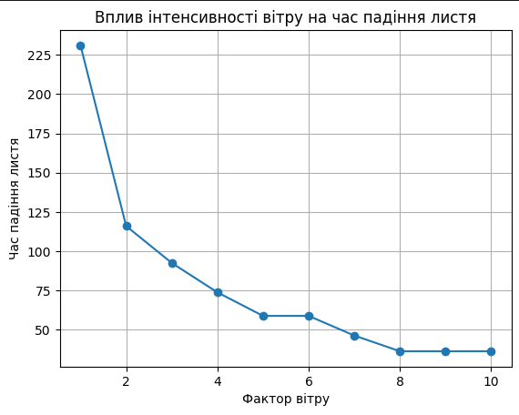
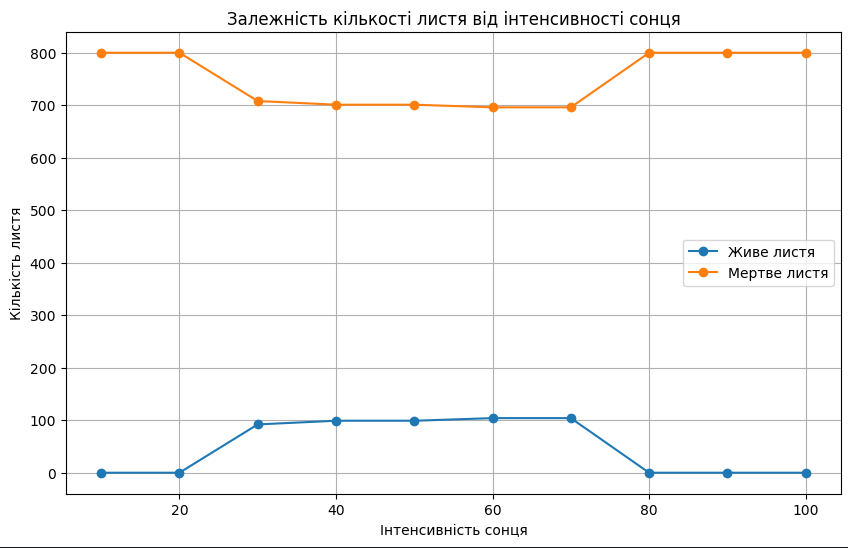
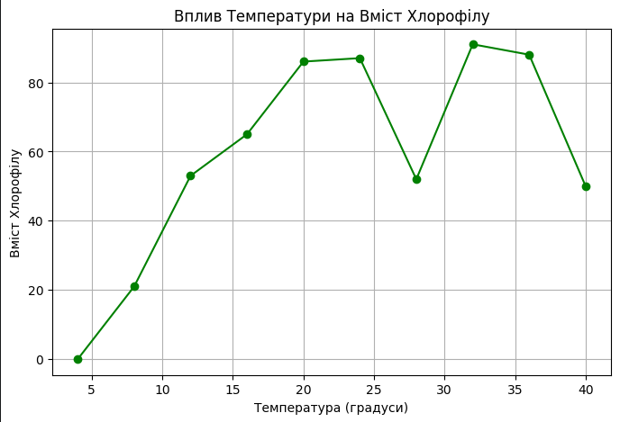

## Комп'ютерні системи імітаційного моделювання

## Спм-22-6, **Шумов Д.О**

### Лабораторна робота №**1**. Опис імітаційних моделей та проведення обчислювальних експериментів

### Варіант 11, модель у середовищі NetLogo:
[Autumn](https://www.netlogoweb.org/launch#http://www.netlogoweb.org/assets/modelslib/Sample%20Models/Biology/Autumn.nlogo)

### Вербальний опис моделі:

 Ця модель імітує процес опадання листя на деревах залежить від параметрів середовища. Модель дозволяе вивчити вплив зовнышних факторыв на цю подію.

### Керуючі параметри:
 - **number-of-leaves** - пареметр вказує скільки листья буде на дереві.
 - **start-sugar-mean** - середнє значення змісту цукру серед листя.
 - **start-sugar-stddev** - розподіл початкового розподілу цукру серед листя.
 - **temperature** - температура навколишнього середовища.
 - **rain-intensity** - інтенсивність дощу в ємуляції.
 - **wind-factor** - сила вітра в ємуляції.
 - **sun-intensity** - інтенсивність впливу сонця.

### Внутрішні параметри:

 - **chlorophyll** - відображає рівень хімічних речовин, що забарвлюють листя в зелений колір.
 - **sugar-level** - показує кількість цукру в листі.
 - **anthocyanin** -  показує рівень хімічних речовин, які забарвлюють листя в червоний колір.
 - **water-level** - відображає кількість води в листі.
 - **carotene** - визначає рівень хімічних речовин, які надають листю жовтий колір.
 - **attachedness** - визначає, наскільки тісно лист прикріплений до дерева.
 - **evaporation-temp** - температура, при якій вода випаровується.
 - **location** - показує місце знаходження капель дощу.
 - **amount-of-water** - показує кількість води.
 - **bottom-line** - визначає, де знаходиться поверхня землі.

### Показники роботи системи:

 - **Leaves** - відображення життєвого циклу листя.
 - **Weather conditions** - графік відображення погодних умов таких як: дощ, сонце, температура, вітер.
 - **Leaf averages** - графік відображення середніх значень змісту таких складників таких як: хлорофіл, вода, цукор, каротин, антоціан, приєднання (міцність з якою
  тримається лист).

### Примітки:

 - Якщо sun-intensity менше ніж 80% листя не жовтіють.
 - За відсутності вітру листя опадає дуже повільно.
 - При певних умовах листя ніколи не падає.

 ### Недоліки моделі:

 - Нема калюж після дощу.
 - За відсутності вітру листя майже не падає.
 - Дощ не впливає на час через який листя впадуть.
 - При певних умовах листя ніколи не падає, сімуляция ніколи не завершуєтся.
 
## Обчислювальні експерименти

### 1. Вплив інтенсивності вітру (wind-factor) на час падіння листя.

Досліджується залежність впливу вітру на час падіння листя.
Експерименти проводяться при 1-10 показника вітру, з кроком 1, усього 10 симуляцій. 
Інші керуючі параметри мають значення за замовчуванням:

- **number-of-leaves**: 800
- **start-sugar-mean**: 50
- **start-sugar-stddev**: 25
- **rain-intensity**: 20
- **temperature**: 28
- **sun-intensity**: 90

<table>
<thead>
<tr><th>Фактор вітру</th><th>Час</th>
</thead>
<tbody>
<tr><td>1</td><td>231</td></tr>
<tr><td>2</td><td>116</td><</tr>
<tr><td>3</td><td>92.5</td</tr>
<tr><td>4</td><td>73.8</td></tr>
<tr><td>5</td><td>58.8</td></tr>
<tr><td>6</td><td>58.8</td></tr>
<tr><td>7</td><td>46.3</td></tr>
<tr><td>8</td><td>36.3</td></tr>
<tr><td>9</td><td>36.3</td</tr>
<tr><td>10</td><td>36.3</td></tr>
</tbody>
</table>

Висновки експерименту:

- Зменшення часу падіння листя: З інтенсивністю вітру зростанням, час падіння листя значно зменшується. Це вказує на те, що сильний вітер прискорює процес відпадання листя з дерева.
- Лінійна залежність: Здається, що існує лінійна залежність між інтенсивністю вітру та часом падіння листя. Це означає, що зі збільшенням фактора вітру час падіння листя зменшується приблизно в однаковому темпі.
- Потенційна гранична точка: Виглядає так, що при деякому значенні інтенсивності вітру час падіння листя стає стабільним і не змінюється. Це може вказувати на наявність граничної точки, коли вітер вже настільки сильний, що всі листя вже відпалили.

### 2. Вплив інтенсивності сонця на опадання листя.

Досліджується вплив інтенсивності сонця (параметр sun-intensity) на час падіння листя в моделі. Експерименти проводяться при 10-100 % інтенсивності сонця, з кроком 10, усього 10 симуляцій.

- **number-of-leaves**: 800
- **start-sugar-mean**: 50
- **start-sugar-stddev**: 25
- **rain-intensity**: 20
- **temperature**: 28
- **wind-factor**: 5

<table>
<thead>
<tr><th>Інтенсивність сонця</th><th>Живе листя</th><th>Мертве листя</th></tr>
</thead>
<tbody>
<tr><td>10</td><td>0</td><td>800</td></tr>
<tr><td>20</td><td>0</td><td>800</td></tr>
<tr><td>30</td><td>92</td><td>708</td></tr>
<tr><td>40</td><td>99</td><td>701</td></tr>
<tr><td>50</td><td>99</td><td>701</td></tr>
<tr><td>60</td><td>104</td><td>696</td></tr>
<tr><td>70</td><td>104</td><td>696</td></tr>
<tr><td>80</td><td>0</td><td>800</td></tr>
<tr><td>90</td><td>0</td><td>800</td></tr>
<tr><td>100</td><td>0</td><td>800</td></tr>
</tbody>
</table>

Висновки експерименту:

- Інтенсивність сонця 10-20: У цьому діапазоні не спостерігається живого листя. Це може вказувати на те, що при низькій інтенсивності сонця листя може відпадати дуже швидко або процес фотосинтезу може бути обмеженим.

- Інтенсивність сонця 30-60: Спостерігається зростання кількості живого листя від 92 до 104 та відповідне зменшення кількості мертвого листя від 708 до 696. Це може вказувати на те, що при певній інтенсивності сонця відбувається позитивний вплив на ріст та збереження листя.

- Інтенсивність сонця 80-100: У цьому діапазоні знову спостерігається відсутність живого листя, але збільшується кількість мертвого листя. Це може бути пов'язано з тим, що при надмірній інтенсивності сонця може виникати стрес для листя, що призводить до його відмирання.

### 3. Вплив температури на вміст хлорофілу в листі.

Досліджується вплив температури на вміст хлорофілу в листі. Хлорофіл є основним пігментом, необхідним для проведення фотосинтезу в рослинах. Фотосинтез відбувається у клітинах листя, і його ефективність може залежати від різних факторів, включаючи температуру.

- **number-of-leaves**: 800
- **start-sugar-mean**: 50
- **start-sugar-stddev**: 25
- **rain-intensity**: 20
- **sun-intensity**: 50
- **wind-factor**: 5

<table>
<thead>
<tr><th>Температура</th><th>Хлорофіл</th></tr>
</thead>
<tbody>
<tr><td>4</td><td>0</td></tr>
<tr><td>8</td><td>21</td></tr>
<tr><td>12</td><td>53</td></tr>
<tr><td>16</td><td>65</td></tr>
<tr><td>20</td><td>86</td></tr>
<tr><td>24</td><td>87</td></tr>
<tr><td>28</td><td>52</td></tr>
<tr><td>32</td><td>91</td></tr>
<tr><td>36</td><td>88</td></tr>
<tr><td>40</td><td>50</td></tr>
</tbody>
</table>

Висновки експерименту:

- Залежність вмісту хлорофілу від температури: За загальною тенденцією можна визначити, що вміст хлорофілу у листі зростає при підвищенні температури до певного пункту (приблизно 20 градусів), після чого може відбуватися його зниження.

- Оптимальна температура для синтезу хлорофілу: Максимальний вміст хлорофілу зафіксовано при температурі близько 20 градусів. Це може вказувати на оптимальні умови для процесів фотосинтезу та синтезу хлорофілу в рослині.

- Потенційне зниження вмісту хлорофілу при високих температурах: Відмічається, що при температурі вище 20 градусів вміст хлорофілу може зменшуватися. Це може бути пов'язане із стресом для рослини або іншими фізіологічними аспектами.
