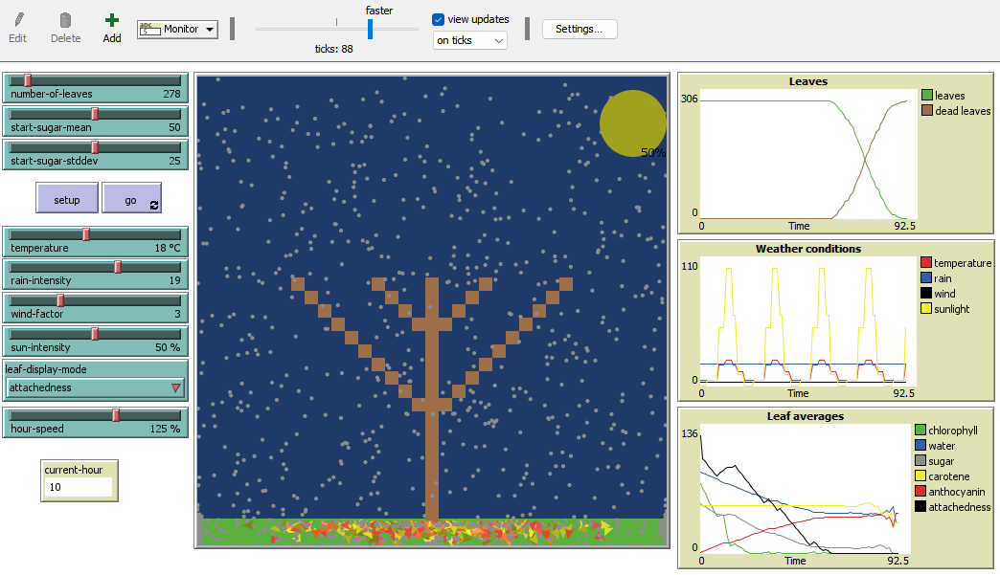

## Комп'ютерні системи імітаційного моделювання
## СПм-22-6, Шумов Дмитро Олександрович
### Лабораторна робота №**2**. Редагування імітаційних моделей у середовищі NetLogo

 

### Варіант 11, Модель у середовищі NetLogo:
[Autumn](https://www.netlogoweb.org/launch#http://www.netlogoweb.org/assets/modelslib/Sample%20Models/Biology/Autumn.nlogo)  
Додати добові цикли зміни інтенсивності сонячного світла, що також повинно впливати на температуру. Тривалість модельної "доби" встановлюється у внутрішніх параметрах.

Для початку зробив зміни, що дозволять задавати час доби:

Додав глобальні змінні для задання довжини доби та для відслідковування поточного часу:
<pre>
  day-hour           ;; Довжина доби
  current-hour       ;; Поточний час
</pre>
Та ініціалізував їх у *setup*:
<pre>
  set day-hour 24     ;; Задання довжини доби
  set current-hour 0  ;; Ініціалізація початку доби
</pre>
Далі відповідно додав у процедуру *go* зміни для того, щоб задіяти ці змінні:
<pre>
                                       ;; тут задію процедуру для впливу на сонячне світло та температуру
    set current-hour current-hour + 1  ;; хід часу
    if current-hour >= 24 [            ;; якщо 24 години пройшло від початку дня - починати новий.
    set current-hour 0
    ]
</pre>
Саму процедуру назвав *day-time* розробив таким чином, щоб вона розділяла добу на промежутки різної довжини. Мірою буде година. Розділив зважаючи на такі дані з інтернету:
Відношення часу доби до інтенсивності лучів сонця та температури за умови що пора року - осінь, а місце дослідження - Харків, Україна:
<table>
<thead>
<tr><th>Година</th><th>Інтенсивність сонячних променів</th><th>Температура</th></tr>
</thead>
<tbody>
<tr><td>00:00</td><td>5</td><td>5</td></tr>
<tr><td>01:00</td><td>5</td><td>5</td></tr>
<tr><td>02:00</td><td>5</td><td>5</td></tr>
<tr><td>03:00</td><td>5</td><td>5</td></tr>
<tr><td>04:00</td><td>5</td><td>5</td></tr>
<tr><td>05:00</td><td>10</td><td>6</td></tr>
<tr><td>06:00</td><td>20</td><td>8</td></tr>
<tr><td>07:00</td><td>40</td><td>10</td></tr>
<tr><td>08:00</td><td>60</td><td>12</td></tr>
<tr><td>09:00</td><td>80</td><td>15</td></tr>
<tr><td>10:00</td><td>90</td><td>18</td></tr>
<tr><td>11:00</td><td>95</td><td>20</td></tr>
<tr><td>12:00</td><td>100</td><td>22</td></tr>
<tr><td>13:00</td><td>95</td><td>23</td></tr>
<tr><td>14:00</td><td>90</td><td>22</td></tr>
<tr><td>15:00</td><td>80</td><td>20</td></tr>
<tr><td>16:00</td><td>60</td><td>18</td></tr>
<tr><td>17:00</td><td>40</td><td>16</td></tr>
<tr><td>18:00</td><td>20</td><td>14</td></tr>
<tr><td>19:00</td><td>10</td><td>12</td></tr>
<tr><td>20:00</td><td>5</td><td>10</td></tr>
<tr><td>21:00</td><td>5</td><td>8</td></tr>
<tr><td>22:00</td><td>5</td><td>6</td></tr>
<tr><td>23:00</td><td>5</td><td>5</td></tr>
</tbody>
</table>

Та виглядає сама процедура таким чином:
<pre>
to day-time                                         ;; Процедура, що розбиває день на промежутки та задає відповідні цьому промежутку показники інтенсивності сонячного світла та температури
let time-of-day current-hour / day-hour * 24        ;; Створив локальну змінну для розбиття доби на промежутки та щоб оперувати не глобальною змінною
  if time-of-day > 0 and time-of-day < 2 [          ;; З 0 до 2
    set sun-intensity 0                             ;; Інтенсивність сонячних промінів
    set temperature 5                               ;; Температура
  ]
  if (time-of-day > 2 and time-of-day < 6) [        ;; З 2 до 6
    set sun-intensity 5
    set temperature 5
  ]
  if time-of-day > 6 and time-of-day < 8 [          ;; З 6 до 8
    set sun-intensity 20
    set temperature 10
  ]
  
  if time-of-day > 8 and time-of-day < 12 [         ;; З 8 до 12
    set sun-intensity 50
    set temperature 18
  ]

  if time-of-day > 12 and time-of-day < 15 [        ;; З 12 до 15
    set sun-intensity 100
    set temperature 22
  ]
  
  if time-of-day > 15 and time-of-day < 18 [        ;; З 15 до 18
    set sun-intensity 60
    set temperature 18
  ]
  
  if time-of-day > 18 and time-of-day < 20 [        ;; З 18 до 20
    set sun-intensity 10
    set temperature 12
  ]
  
  if time-of-day > 20 and time-of-day < 21 [        ;; З 20 до 21
    set sun-intensity 5
    set temperature 10
  ]
  
  if time-of-day > 21 and time-of-day < 24 [        ;; З 21 до 24
    set sun-intensity 0
    set temperature 5
  ]
end
</pre>
Після внесених змін за варіантом модель має наступний вигляд:

Як можна побачити на графіку на скриншоті - вплив температури та сонця варіюється у залежності від часу доби.

### Внесені зміни за варіантом:
Додав монітор для відстежування поточного часу:

Додав можливість зміни швидкості проходження доби:
<pre>
to go
...
    day-time                                            ;; задіяв процедуру для впливу на сонячне світло та температуру
    set current-hour current-hour + hour-speed * 0.01   ;; хід часу
    if current-hour >= 24 [                             ;; якщо 24 години пройшло від початку дня - починати новий.
    set current-hour 0
    ]
...
end
</pre>

Та вніс зміну у процедуру *day-time*:
<pre>
let time-of-day round current-hour / day-hour * 24
</pre>

Додав лічильник днів:

<pre>
to go
...
  set day-count day-count + 1
...
end
</pre>

Після усіх внесених змін модель виглядає наступним чином:

## Обчислювальні експерименти
### Вплив швидкості проходження доби на процес симуляції:
Досліджується вплив **hour-speed** на загалну швидкість закінчення симуляції.

Експеримент проводиться при таких значеннях керуючих параметрів:
- **number-of-leaves** -278
- **start-sugar-mean** - 50
- **start-sugar-stddevv** - 25
- **rain-intensivity** - 19
- **wind-factor** - 3

<table>
<thead>
<tr><th>Швидкість ходу часу(%)</th><th>Кількість тіків</th></tr>
</thead>
<tbody>
<tr><td>1</td><td>72</td></tr>
<tr><td>25</td><td>65</td></tr>
<tr><td>50</td><td>90</td></tr>
<tr><td>75</td><td>94</td></tr>
<tr><td>100</td><td>97</td></tr>
<tr><td>125</td><td>88</td></tr>
<tr><td>150</td><td>115</td></tr>
<tr><td>175</td><td>100</td></tr>
<tr><td>200</td><td>103</td></tr>
</tbody>
</table>

Швидкість ходу часу 1%:

Як можна помітити - було небагато впливу погоди у зв'язку з повільною швидкосітю проходження доби.

Швидкість ходу часу 25%:

Швидкість ходу часу 50%:

Швидкість ходу часу 75%:

Швидкість ходу часу 100%:

Швидкість ходу часу 125%:

Швидкість ходу часу 150%:

Швидкість ходу часу 175%:

Швидкість ходу часу 200%:

Як можна помітити з скріншотів, зроблених під час експерименту - швидкість проходження доби впливає на симуляцію дуже нестабільно - під час швидкості доби у 150% листя залишалися на дереві найдовше, але це зважаючи на факт рандомізації інших параметрів, включаючи кількість впавших капель дощу, подутий вітер та ін.
