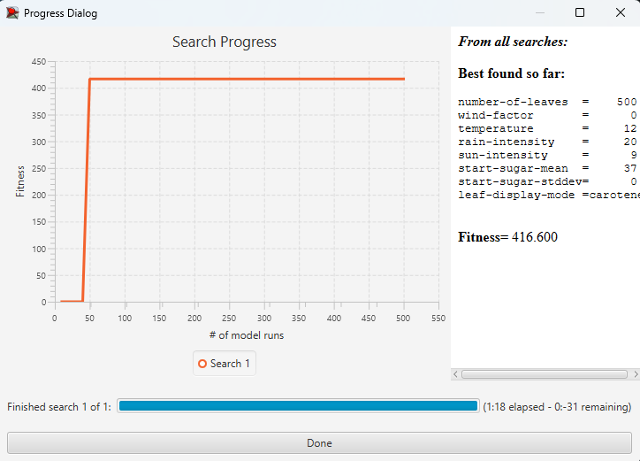
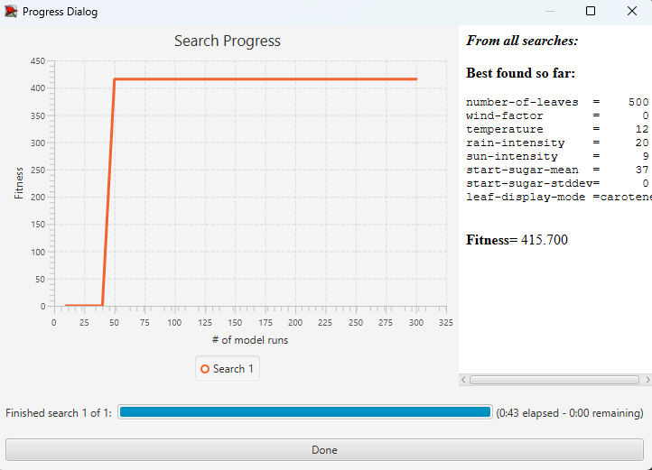

## Комп'ютерні системи імітаційного моделювання
## СПм-22-6, Шумов Дмитро Олександрович
### Лабораторна робота №**3**. Використання засобів обчислювального интелекту для оптимізації імітаційних моделей

 

### Варіант 11, Модель у середовищі NetLogo:
[Autumn](https://www.netlogoweb.org/launch#http://www.netlogoweb.org/assets/modelslib/Sample%20Models/Biology/Autumn.nlogo)  

 

### Вербальний опис моделі:
- **[Вербальний опис моделі лабораторна робота №1] (https://github.com/ShumovNure/ksim/blob/main/lab1/lab1.md)**

 

### Налаштування середовища BehaviorSearch:

**Обрана модель**:
<pre>
C:\Users\dishu\OneDrive\Рабочий стол\КСІМ lab\Autumn.nlogo
</pre>
**Параметри моделі** (вкладка Model):  
*Параметри та їх модливі діапазони були **автоматично** вилучені середовищем BehaviorSearch із вибраної імітаційної моделі, для цього є кнопка «Завантажити діапазони параметрів із інтерфейсу моделі»*:
<pre>
["number-of-leaves" 500]
["wind-factor" [0 1 10]]
["temperature" [0 1 40]]
["rain-intensity" [0 1 30]]
["sun-intensity" [0 1 100]]
["start-sugar-mean" [0 1 100]]
["start-sugar-stddev" [0 1 50]]
["leaf-display-mode" "solid" "chlorophyll" "water" "sugar" "carotene" "anthocyanin" "attachedness"]

</pre>
Використовувана **міра**:  
Для фітнес-функції *(вона ж функція пристосованості або цільова функція)* було обрано **значення кількості лист**. Саме кількість тактів оприділяє успішність симуляції, адже чимм довше проводилася симуляція тим краще були підібрані керуючі параметри та тим довше листя залишалися на дереві. Вираз для її розрахунку вказано у параметрі "**Measure**":
<pre>
count leaves
</pre>
Кількість тактів повинна враховуватися **у кінці** симуляції тривалістю 500 тактів, починаючи з 0 такту симуляції.  
Параметр зупинки за умовою ("**Stop if**") у разі не використовувався.  
Загальний вигляд вкладки налаштувань параметрів моделі:  

**Налаштування цільової функції** (вкладка Search Objective):  
Метою підбору параметрів імітаційної моделі є **максимізація** значення – це вказано через параметр "**Goal**" зі значенням **Maximize Fitness**. Враховуватися повинно саме кінцеве значення. Для цього у параметрі "**Collected measure**", що визначає спосіб обліку значень обраного показника, вказано **AT_FINAL_STEP**.  
Щоб уникнути викривлення результатів через випадкові значення, що використовуються в логіці самої імітаційної моделі, **кожна симуляція повторюється по 10 разів**, результуюче значення розраховується як **середнє арифметичне**. 
Загальний вигляд вкладки налаштувань цільової функції:  

**Налаштування алгоритму пошуку** (вкладка Search Algorithm):  
Загальний вид вкладки налаштувань алгоритму пошуку:  

 

### Результати використання BehaviorSearch:
Діалогове вікно запуску пошуку:  

Результат пошуку параметрів імітаційної моделі, використовуючи **генетичний алгоритм**:  

Результат пошуку параметрів імітаційної моделі, використовуючи **випадковий пошук**:  

